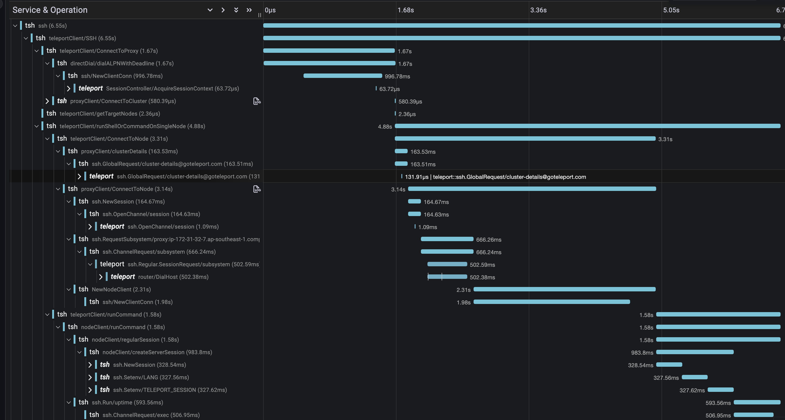
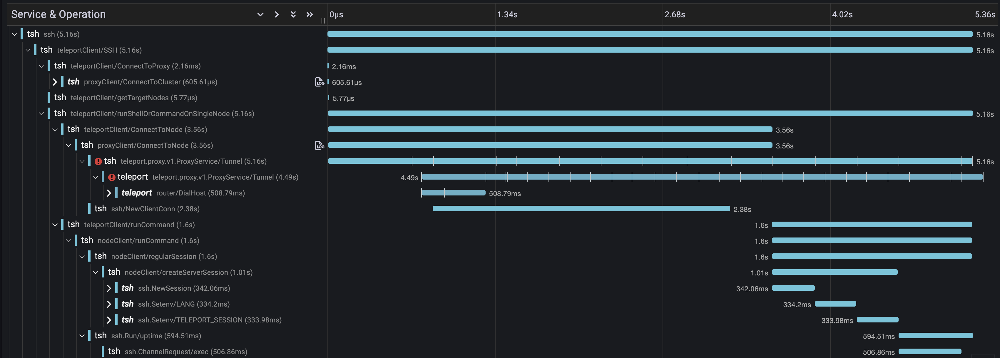

# RFD 0100 - Use gRPC to proxy SSH connections to Nodes

# Required Approvers

* Engineering @zmb3 && (fspmarshall || espadolini)

## What

Add an alternate transport mechanism to the Proxy for proxying connections
to Nodes

## Why

One of the primary contributors to `tsh ssh` connection latency is the
time it takes to perform an SSH handshake. All connections to a Node via
`tsh` are proxied via a SSH session established with the Proxy. Which means 
that in order to connect to a Node `tsh` must perform at least two SSH handshakes,
one with the Proxy to setup the connection transport and another with the
target Node over the transport to establish the user's SSH connection.

## Details

`tsh ssh` needs to connect to the target Node via the Proxy, but it
doesn't have to use SSH for that communication. A new gRPC service exposed
by the Proxy could perform the same operations as the existing SSH server
but without as much overhead required to establish the session. To minimize
changes both in `tsh` and on Cluster admins, the existing SSH port can be multiplexed
to accept both SSH and gRPC by leveraging the TLS ALPN protocol `teleport-proxy-grpc-ssh`.
Any incoming requests on the SSH listener with said ALPN protocol will be routed
to the gRPC server and all other requests to the SSH server.

Note: a gRPC server is already exposed via the Proxy web address that users the ALPN protocol
`teleport-proxy-grpc`. In order to not conflict the new ALPN protocol is required. Reusing the
existing gRPC server is not an option since it has aggressive keep alive
parameters and is only enabled when TLS Routing is enabled.

### Proto Definition

The specification is modeled after the [ProxyService](https://github.com/gravitational/teleport/blob/master/api/proto/teleport/legacy/client/proto/proxyservice.proto)
which is a similar transport mechanism leveraged for Proxy Peering.

```proto
service ProxyConnectionService {
  // GetClusterDetails provides cluster information that may affect how transport
  // should occur.
  rpc GetClusterDetails(GetClusterDetailsRequest) returns (GetClusterDetailsResponse);

  // ProxySSH establishes an SSH connection to the target host over a bidirectional stream.
  // 
  // The client must first send a DialTarget before the connection is established. Agent frames
  // will be populated if SSH Agent forwarding is enabled for the connection.
  rpc ProxySSH(stream ProxySSHRequest) returns (stream ProxySSHResponse);
  
  // ProxyCluster establishes a connection to the target cluster
  // 
  // The client must first send a ProxyClusterRequest with the desired cluster before the 
  // connection is establishsed.
  rpc ProxyCluster(stream ProxyClusterRequest) returns (stream ProxyClusterResponse);
}

// Request for ProxySSH
//
// The client must send a request with the Target
// populated before the transport is established
message ProxySSHRequest {
  // Contains the information about the connection target. Must
  // be sent first so the SSH connection can be established.
  Target dial_target = 1;
  // Raw SSH payload
  Frame ssh_frame = 2;
  // Raw SSH Agent payload, populated for agent forwarding
  Frame agent_frame = 3;
}

// Response for ProxySSH
message ProxySSHResponse {
  // Cluster information returned *ONLY* with the first frame
  ClusterDetails details = 1;
  // SSH payload
  Frame ssh_frame = 2;
  // SSH Agent payload, populated for agent forwarding
  Frame agent_frame = 3;
}

// Request for ProxyCluster
//
// The client must send a request with the Target
// populated before the transport is established
message ProxyClusterRequest {
  // Name of the cluster to connect to. Must
  // be sent first so the connection can be established.
  string cluster = 1;
  // Raw payload
  Frame frame = 2;
}

// Response for ProxyCluster
message ProxyClusterResponse {
  // Raw payload
  Frame frame = 1;
}

// Encapsulates protocol specific payloads
message Frame {
  // The raw packet of data 
  bytes payload = 1;
}

// TargetHost indicates which server the connection is for
message TargetHost {
  // The hostname/ip/uuid of the remote host
  string host = 1;
  // The port to connect to on the remote host
  int port = 2;
  // The cluster the server is a member of
  string cluster = 3;
}

// Request for GetClusterDetails.
message GetClusterDetailsRequest { }

// Response for GetClusterDetails.
message GetClusterDetailsResponse {
  // Cluster configuration details
  ClusterDetails details = 1;
}

// ClusterDetails contains details about the cluster configuration
message ClusterDetails {
  // If proxy recording mode is enabled
  bool recording_proxy = 1;
  // If the cluster is running in FIPS mode
  bool fips_enabled = 2;
}
```

The `ProxySSH` RPC establishes a connection to a Node on behalf of the user.
The client must first send a `Target` message which declares the target server that
the connection is for. If the target exists and session control allows, the server
will establish the connection and respond with a message. Each side may then send
`Frame`s until the connection is terminated.

Since the Proxy creates an SSH connection to the Node on behalf of the user in proxy
recording mode the user *must* forward their agent to facilitate the connection.
Currently when `tsh` determines the Proxy is performing the session recording it will
forward the user's agent over a SSH channel. The Proxy then communicates SSH Agent protocol
over that channel to sign requests. `tsh` utilizes `agent.ForwardToAgent` and
`agent.RequestAgentForwarding` from `x/crypto/ssh/agent` to set up the channel and serve
the agent over the channel to the Proxy.

To achieve the same functionality using the gRPC stream proposed above, the SSH Agent
protocol can be multiplexed over the stream in addition to the SSH protocol. When `tsh`
determines proxy recording is in effect it can leverage `agent.ServeAgent` directly, passing
in an `io.ReadWriter`which sends and receives an agent `Frame`s when it is written to and
read from. The server side can communicate with the local agent by using `agent.NewClient`
on a similar `io.ReadWriter`.

The end result is both SSH and SSH Agent protocol being transported across the same stream
to enable both the SSH connection to the target Node and allowing the Proxy to communicate
with the user's local SSH agent in a similar manner to way it works to date.

## Performance

Below are two traces captured with both Proxy transport mechanisms that illustrate the latency
reduction.

#### SSH

#### gRPC



The existing SSH transport took 6.73s to execute `tsh user@foo uptime`, while the same
command via the gRPC transport took 5.36s resulting in a ~20% reduction in latency. 

## Future Considerations

### Session Resumption

The proposed transport mechanism can be extended to support session resumption by altering
the `Target` and `Frame` messages to include a connection id and sequence number:


```proto
// Encapsulates protocol specific payloads
message Frame {
  // The raw packet of data
  bytes payload = 1;
  // A unique identifier for connection
  uint64 connection_id = 2;
  // The position of the frame in relation to others
  // for this connection
  uint64 sequence_number = 3;
}

// Target indicates which server to connect to
message Target {
  // The hostname/ip/uuid of the remote host
  string host = 1;
  // The port to connect to on the remote host
  int port = 2;
  // The cluster the server is a member of
  string cluster = 3;
  // The unique identifier for the connection. When
  // populated it indicates the session is being resumed.
  uint64 connection_id = 4;
  // The frame to resume the connection from. Both the
  // connection_id and sequence_number must be provided for
  // resumption.
  uint64 sequence_number = 3;
}
```

The `connection_id` and `sequence_number` identify which connection a `Frame` is for and
what position the `Frame` is relative to others for that connection. To resume a session the
`Target` must populate both the `connection_id` and `sequence_number`. If `connection_id` is
unknown by the Node then the connection is aborted. All frames with a `sequence_number` equal or
greater than the provided will be resent after the SSH connection is established.

The Node must maintain a mapping of `connection_id` to `Frame`s which keeps a backlog of most
recent `Frame`s in the correct order.

## Security

The gRPC server will require mTLS for authentication and perform the same RBAC
and session control checks as the current SSH server does. Agent forwarding will
occur as it does today with the exception that the SSH Agent Protocol will use a
gRPC stream instead of an SSH channel for transport.

## UX

The behavior of `tsh ssh` should remain the same regardless of the configured
session recording mode. The time it takes to establish a session may be noticeably
faster depending on proximity of the client and the Proxy.
